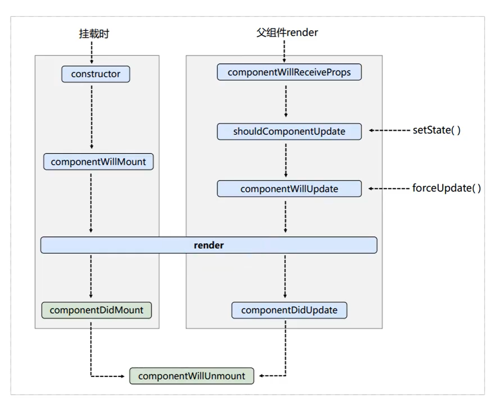
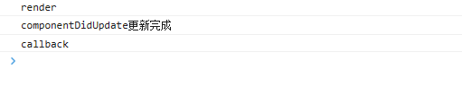

## react 学习笔记

### 项目初始化操作

+ 暴露配置文件 命令：

```
  npm run eject
```

+ 配置路径别名： webpack.config.js

```js
 alias: {
  "@"
:
  paths.appSrc
}
```

### 配置代理路径

+ 在src 目录新建setupProxy.js 文件
+ 安装配置依赖

```
npm install http-proxy-middleware
```

+ 在setupProxy.js写入

```js
const {createProxyMiddleware} = require("http-proxy-middleware")
module.exports = function (app) {
  app.use(
      createProxyMiddleware("/api", {
        target: "http://localhost:8089",
        changeOrigin: true,
        pathRewrite: {
          "^/api": ""
        }
      })
  )
}
```

### jsx 基本语法

+ react 中只会渲染 string、number、数组类型。渲染数组类型时会把数组每一项都进行渲染
+ 渲染其他类型时控制台会报错，null，undefined，Boolean类型不会报错，但页面不会显示

### 函数式组件传递props

+ 可以对传递的prop赋值默认值

```js
Dome01.defaultProps = {
  childName: "default val"
}
```

+ 安装 prop-types 插件可实现对传递值的限制

```js
Dome01.propTypes = {
  childName: PropTypes.string,
  childTitle: PropTypes.string.isRequired,
  childAge: PropTypes.oneOfType([PropTypes.string, PropTypes.number])
}
```

+ props 值不可修改和扩展 是使用Object.freeze()方法冻结传递给组件的 props 对象

```js
// 冻结对象 不可劫持、修改、删除、新增
Object.freeze()

// 密封对象 可修改，不可删除、新增、不可劫持
Object.seal()

// 不可扩展对象
Object.preventExtensions()
```

+ 如果想要修改props中的值可以使用如下方法

```js
import React, {useState} from 'react';

function MyComponent(props) {
  const [name, setName] = useState(props.name);

  const handleClick = () => {
    setName('new name');
  };

  return (
      <div>
        <p>Name: {name}</p>
        <button onClick={handleClick}>Change Name</button>
      </div>
  );
}

export default MyComponent;
```

### 插槽

+ react中没有vue中slot 需要自己实现插槽
+ react中Children提供了如下方法
    + React.Children.map <font color="red">遍历children返回一个新的数组</font>
    + React.Children.forEach <font color="red">遍历children</font>
    + React.Children.count <font color="red">返回children个数</font>
    + React.Children.only <font color="red">是否仅包含单个子元素，并返回该子元素</font>
    + React.Children.toArray <font color="red">将children 转换为一个数组，并返回该数组</font>
+ 例子如下：

```jsx
<div>插槽部分</div>
<div style={{display: "flex", flexDirection: "column"}}>
  {this.children.filter(item => item.props.name === "slot-01")}
  {this.children.findIndex(item => item.props.name === "slot-02") !== -1
      ?
      this.children.filter(item => item.props.name === "slot-02")
      :
      <div>默认插槽内容</div>
  }
  {this.children.filter(item => item.props.name === "slot-03")}
</div>
```

### 函数式组件、类组件

#### 1、区别

+ 静态组件、动态组件
+ 函数式组件没有内部状态state，无法使用setState改变内部状态
+ 函数式组件不可使用forceUpdate强制刷新组件
+ 函数式组件无上下文context
+ 函数式组件在性能方面通常比类组件好
+ 函数式组件没有生命周期

#### 类组件实现动态修改state

```jsx
import react from 'react'
import PropTypes from "prop-types";

class Dome02 extends react.Component {
  constructor(props) {
    super(props);
    this.state = {
      age: 0
    }
  }

  render() {
    let {title} = this.props
    let {age} = this.state
    const add = (flag) => {
      this.setState({
        age: this.state.age + 1
      })
    }
    const less = () => {
      this.setState({
        age: this.state.age - 1
      })
    }
    return (
        <>
          <div>{title}</div>
          <p>{age}</p>
          <div>
            <button onClick={() => add("test")}>增加</button>
            <button onClick={() => less()}>减少</button>
          </div>
        </>
    )
  }
}

Dome02.defaultProps = {
  title: "类组件"
}

Dome02.propTypes = {
  title: PropTypes.string.isRequired
}
export default Dome02
```

+ 插槽实现和改变内部状态的效果图
  

### react生命周期

+ 在react严格模式中生命周期会调用两次
+ 生命周期图
  
+ **constructor**
    + 生命周期中执行的第一个函数
+ **getDerivedStateFromProps**
    + componentWillReceiveProps 的替代品
    + 用于接受新的 props 改变state

```jsx
import React, {Component} from 'react';

class MyComponent extends Component {
  constructor(props) {
    super(props);
    this.state = {
      count: props.count
    };
  }

  static getDerivedStateFromProps(nextProps, prevState) {
    if (nextProps.count !== prevState.count) {
      return {count: nextProps.count};
    }
    return null;
  }

  render() {
    return (
        <div>
          <p>Count: {this.state.count}</p>
          <button onClick={() => {
            this.setState({
              count: this.state.count++
            })
          }}>增加
          </button>
        </div>
    );
  }
}

export default MyComponent;
```

### React.Component 与 React.PureComponent 区别

+ React.PureComponent 通过实现 shouldComponentUpdate() 方法来自动对比前后两次渲染的props和state是否有变化，从而自动决定是否需要重新渲染组件，而
  React.Component 不会自动做出这个决定。
+ 若在React.PureComponent重写shouldComponentUpdate()方法会报错
+ React.PureComponent 是通过浅比较来判断是否需要重新渲染，当地址没有改变，数据改变时组件不会重新渲染
+ 下列中是数据改变地址没变，导致组件没有重新渲染
  ```jsx
  <button onClick={() => {
     arr.push(4)
     this.setState({
        arr: arr
     })
  }}>增加</button>
  ```
+ 可以通过下列方式实现组件更新
  ```jsx
  <button onClick={() => {
     arr.push(4)
     this.setState({
        arr: [...arr]
     })
  }}>增加</button>
  ```
+ 或者使用this.forceUpdate()强制刷新

### react 获取Dom对象

+ 类组件中获取Dom对象
    + 不推荐使用this.refs获取实例对象

```jsx
class ClassGetRef extends react.PureComponent {
  constructor(props) {
    super(props);
    this.three = react.createRef()
  }

  componentDidMount() {
    console.log(this.refs.first)
    console.log(this.tow)
    console.log(this.three.current)
  }

  render() {
    return (
        <>
          <div title="方式一" ref="first">通过this.refs获取</div>
          <div title="方式二" ref={x => this.tow = x}>通过回调函数</div>
          <div title="方式三" ref={this.three}>通过createRef获取</div>
        </>
    )
  }
}
```

+ 函数式组件获取DOM

```jsx
import react, {useState, useRef, useEffect, forwardRef, useImperativeHandle} from 'react'

export const FunGetRef = forwardRef(function (props, ref) {
  const myEl = useRef()
  const [count, setCount] = useState(0)
  useImperativeHandle(ref, () => ({
    setElement(val) {
      return setCount(val)
    },
    getElement() {
      return count
    }
  }))
  useEffect(() => {
    console.log(myEl.current)
  })
  return (
      <>
        <div title="函数式组件获取ref" ref={myEl}>函数式组件获取ref</div>
        <p>{count}</p>
        <button onClick={() => {
          setCount((val) => {
            return val + 1
          })
        }}>增加
        </button>
      </>
  )
})
```

### setState额外知识

+ setState 第二个参数是一个回调函数会在视图更新完成之后吊起

  ```jsx
  <button onClick={() => {
    this.setState({
      val: val + 1
    }, () => {
      console.log("callback")
      this.inputElement.focus()
    })
  }}>改变值后获取焦点</button>
  ```
  
+ setState 更新机制
    + 更新是异步更新
    + 会将所有setState放进一个更新队列中
    + 在后面统一调用该队列
    + 如果想要立即执行可以使用flushSync进行刷新
  ```jsx
  import react from "react";
  
  class Dome06 extends react.Component {
    constructor(props) {
      super(props);
      this.state = {
        x: 0,
        y: 10,
        z: 20
      }
    }
    render() {
      console.log("render")
      const {x, y, z} = this.state
      const change = () => {
        this.setState({x: x + 1})
        this.setState({y: y + 1})
        this.setState({z: z + 1})
        console.log(this.state)
      }
      return (
          <>
            <div>setState更新机制</div>
            <p>x:{x}，y:{y}，z:{z}</p>
            <button onClick={() => change()}>改变值后获取焦点</button>
          </>
      )
    }
  }
  ```

### react 中的合成事件

+ react中使用到的如onclick、onchange 等事件都是合成事件
+ 使用合成事件是为了更好的兼容
+ 对于当前事件对象如果要使用是放在传递参数的最后一个的

```jsx
class Dome07 extends react.Component {
  change1(x, event) {
    console.log(this)
    console.log(event, x)
  }

  render() {
    const change2 = function (event) {
      console.log(this)
      console.log(event)
    }
    const change3 = (event) => {
      console.log(this)
      console.log(event)
    }
    return (
        <>
          <button onClick={this.change1.bind(this, 10)}>按钮一</button>
          <br/>
          <button onClick={change2}>按钮二</button>
          <br/>
          <button onClick={change3}>按钮三</button>
          <br/>
        </>
    )
  }
}
```

### react 中事件绑定机制

+ 绑定机制是通过事件委托实现的
+ 并不是在dom元素上直接添加
+ 事件委托实例

```jsx
import react from "react";
import "@/style/Dome09.scss"

class Dome09 extends react.Component {
  render() {
    const root = () => {
      console.log("root：冒泡阶段")
    }
    const rootCapture = (ev) => {
      console.log("rootCapture：捕获阶段")
    }
    const prent = () => {
      console.log("prent：冒泡阶段")
    }
    const prentCapture = () => {
      console.log("prentCapture：捕获阶段")
    }
    const child = () => {
      console.log("child：冒泡阶段")
    }
    const childCapture = () => {
      console.log("childCapture：捕获阶段")
    }
    return (
        <>
          <div className="root" onClick={root} onClickCapture={rootCapture}>
            <div className="prent" onClick={prent} onClickCapture={prentCapture}>
              <div className="child" onClick={child} onClickCapture={childCapture}></div>
            </div>
          </div>

        </>
    )
  }
}

const root = document.getElementById("root")

const body = document.querySelector("body")
root.addEventListener("click", function (ev) {
  console.log("#root事件捕获阶段")
}, true)


root.addEventListener("click", function (ev) {
  console.log("#root事件冒泡阶段")
})

body.addEventListener("click", function (ev) {
  console.log("body事件捕获阶段")
}, true)


body.addEventListener("click", function (ev) {
  console.log("body事件冒泡阶段")
})
export default Dome09
```

+ 为何会出现下列情况
    + react17 以后事件是通过#root 元素进行派发
    + 代码中只对root、body 进行了原生的事件绑定，所以出现图中效果
      
+ addEventListener 第三个参数默认为false，如果设置为true表名在捕获阶段触发事件
+ 因为react实现绑定事件就是通过事件委托来实现的所以在对多个子元素进行绑定事件时不需要在用事件委托
+ vue 中就是对dom元素直接进行事件的添加，所以对多个子元素进行绑定时需要进行事件委托来优化

### TaskDome 实战

+ 已完成

## **hooks**函数

### useState

+ 使函数式组件具有状态，类似于类组件中的setState
+ 实现原理让函数重新执行使其形成闭包。
+ 一次只能管理一个状态，要管理多个使用多个useState或者使用解构。
+ 异步批量执行。
+ 可使用flushSync 强制刷新。
+ 性能方面useState通过Object.is来比较新老状态值，相同则跳过视图重新渲染。
+ 惰性初始state 如果state的初始值很计算量很复杂，且就首次会计算，为了避免这种情况发生可在useState中传递一个函数，函数只会才初始化的时候调用一次。

```jsx
import {useState} from "react";
import {Button} from "antd";
import {flushSync} from "react-dom"

const Dome10 = function (props) {
  const [sup, setSup] = useState(0),
      [noSup, setNoSup] = useState(0)
  return (
      <>
        <header>总人数：{sup + noSup}</header>
        <div>
          <span>支持人数{sup}</span>
          <Button type={"primary"} onClick={() => {
            setSup(sup + 1)
          }}>增加</Button>
        </div>
        <div>
          <span>反对人数{noSup}</span>
          <Button type={"primary"} onClick={() => {
            setNoSup(noSup + 1)
          }}>增加</Button>
        </div>
      </>
  )
}

export default Dome10
```

### useEffect

+ 在组件第一次渲染完成 或者组件每一次更新完成都会调用

```jsx
useEffect(() => {
  console.log("componentDidMount")
})
```

+ 在组件第一次渲染完成时会调用

```jsx
useEffect(() => {
  console.log("componentDidMount")
}, [])
```

+ 在组件第一次渲染完成时或者依赖的状态发生改变

```jsx
useEffect(() => {
  console.log("componentDidMount && 依赖的状态发生改变")
}, [x])
```

+ 返回的函数将在 组件卸载后 被调用 等同于 componentWillUnmount

```jsx
useEffect(() => {
  return () => {
    console.log('componentWillUnmount');
  };
}, []);
```

+ 只能在函数最外层调用Hook 不能再判断，循环中调用Hook
+ 使用useEffect 获取异步数据

```jsx
// 不能直接对useEffect函数使用async 修饰可以通过.then 或者函数调用的方式
useEffect(() => {
  console.log("componentDidMount")
  // 获取异步数据
  const sendGetTaskList = async () => {
    const res = await getTackList({
      limit: 100,
      page: 1,
      state: 0
    })
    setData(res.list)
  }
  sendGetTaskList()
}, [])
```

### useLayoutEffect

+ 功能同useEffect大致相同
+ 区别useLayoutEffect阻塞浏览器渲染DOM

### useRef

+ 获取DOM实例
+ createRef 也可以获取DOM实例与useRef有如下区别
    + useRef 获取的dom实例不会随dom更新而变化，createRef获取的DOM实例每一次都是最新的

```jsx
import React, {useEffect, useRef, useState} from "react";

let copy_box1 = null
let copy_box2 = null
export default function Dome12() {
  const box1 = useRef(null)
  const box2 = React.createRef()
  const [num, setNum] = useState(0)

  useEffect(() => {
    if (!copy_box1 && !copy_box2) {
      copy_box1 = box1
      copy_box2 = box2
    }
    console.log(box1 === copy_box1)
    console.log(box2 === copy_box2)
  })
  return (
      <>
        <div>
          <span ref={box1} onClick={() => {
            setNum(num + 1)
          }}>span1 : {num}</span>
          <span ref={box2}>span2</span>
        </div>

      </>
  )
};
```

### useEffect 使用细节

+ 将Task用函数式组件重写
+ 可用于页面首次渲染发送请求
+ 若是像taskHooks中，请求数据依赖于某个数据应该将将其填入依赖
+ 后续index改变，getListInfo中index也会是最新的index，从而获取的数据也是最新的

```jsx
useEffect(() => {
  getListInfo({
    limit: 100,
    page: 1,
    state: index
  })
}, [index])
```

### useMemo

+ 主要作用缓存
+ 性能优化
+ 函数式组件每一次setXX是都会重新渲染
+ 就算依赖值没有发生改变，函数重新渲染时还是会重新执行一遍
+ useMemo 会进行缓存，并且只有在依赖发生改变时才会重新执行

```jsx
const percent = useMemo(() => {
  console.log("重新计算")
  return (sup / (sup + protest) * 100).toFixed(2) + "%"
}, [sup, protest])
```

### useCallback

+ 用户返回一个固定地址值的函数
+ 可用作性能优化
+ 可像useMemo一样，填入依赖，只有依赖发生改变时，函数地址才会发生改变
+ **合理使用**

```jsx
const Child2 = react.memo(function (props) {
  console.log("render")
  const {handle} = props
  handle()
  if (!pre) {
    pre = handle
  }
  console.log("判断重新渲染的出的handle是否相同", handle === pre)
  return (
      <>
        <div>child</div>
      </>
  )
})


const Dome16 = function (props) {
  const [num, setNum] = useState(0)
  const handle = useCallback(() => {
    console.log("handle函数")
  }, [])
  return (
      <>
        <Child2 handle={handle}></Child2>
        <div>num：{num}</div>
        <div>
          <button onClick={() => {
            setNum(num + 1)
          }}>change
          </button>
        </div>
      </>
  )
}
export default Dome16
```

### react.memo()

+ 作用创建类似于PurComponent组件效果
+ 若是props中值没有发生改变则不会触发渲染
+ 比较props中是进行的浅比较

### 复合组件通讯

+ 父传子

```jsx
<VoteMain supNum={supNum} oppNum={oppNum}/>
```

+ 子传父通过事件传递（与vue大致相同）

```jsx
<VoteFooter change={this.change}/>
// 其中type就是子传递给父的数据，和vue大致相同
change = type => {
  let {supNum, oppNum} = this.state;
  if (type === 'sup') {
    this.setState({supNum: supNum + 1});
    return;
  }
  this.setState({oppNum: oppNum + 1});
};
//================================
// 子组件内部，其中sup就是传递的值
<button onClick={change.bind(null, 'sup')}>支持</button>
```

### react 上下文对象context

+ 类似于vue provider inject
+ 改变多级父 -> 子 实现 爷-> 孙
+ 改变多级props传递
+ 创建context

```jsx
import React from "react";

const ThemeContext = React.createContext()
export default ThemeContext
```

+ 类组件中使用方法

```jsx
class Parent extends react.Component {
  static contextType = ThemeContext

  constructor(props) {
    super(props);
    console.log(this)
  }

  render() {
    const {parentAge} = this.context
    return (
        <>
          <p>parentAge: {parentAge}</p>
          <div>
            <Son></Son>
          </div>
        </>
    )
  }
}
```

+ 函数式组件中使用 (useContext)

```jsx
const Parent = function (props) {
  const contextType = useContext(ThemeContext)

  const {parentAge} = contextType
  return (
      <>
        <p>parentAge: {parentAge}</p>
        <div>
          <Son></Son>
        </div>
      </>
  )
}
```

+ 类组件、函数组件定义context方式都一致

```jsx
<ThemeContext.Provider value={
  {
    grandAge,
    parentAge,
    sonAge
  }
}>
  <p>grandAge: {grandAge}</p>
  <p>parentAge: {parentAge}</p>
  <p>sonAge: {sonAge}</p>
  <Parent/>
</ThemeContext.Provider>
```
